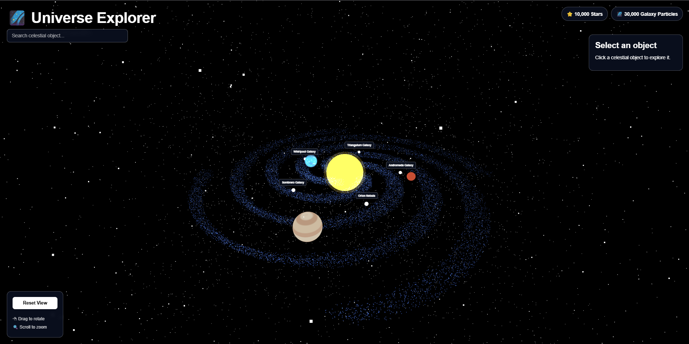

<div align="center">

# 🌌 Universe Explorer 3D

### Interactive 3D Cosmic Visualization

Explore stars, galaxies, planets, and celestial objects in an interactive 3D universe built with Three.js.

<br>



<br><br>


</div>

---

## 📖 About The Project

**Universe Explorer 3D** is an interactive browser-based cosmic visualization built using **Three.js, JavaScript, Vite, CSS3, and GLSL shaders**.

The project creates a visually immersive space environment containing stars, galaxy particles, a stylized solar system, and interactive celestial objects.

Users can rotate and zoom through the 3D scene, search for celestial objects, select objects, and view their astronomical information.

---

## ✨ Features

### 🌌 Cosmic Visualization

- ⭐ 10,000 background stars
- 🌀 30,000 galaxy particles
- 🎨 Custom GLSL shaders
- 🔄 Animated galaxy rotation
- 🌑 Interactive 3D space environment

### ☀️ Solar System

- ☀️ Glowing Sun
- 🌍 Bright stylized Earth
- 🔴 Detailed Mars
- 🪐 Textured Jupiter
- 🔄 Animated planetary movement
- ✨ Planet visual effects

### 🔭 Celestial Object Explorer

- 🖱️ Click celestial objects
- 🏷️ Object labels
- 🔎 Search celestial objects
- 📋 Interactive information panel
- 🎯 Object selection
- 📊 Astronomical information

Information displayed includes:

- Object name
- Object type
- Distance
- Redshift
- Magnitude

### 🎮 Camera Controls

- 🖱️ Drag to rotate
- 🔍 Scroll to zoom
- 🔄 Reset View
- 🎥 Smooth camera controls using OrbitControls

---

## 🛠️ Tech Stack

| Technology | Purpose |
|------------|---------|
| **Three.js** | 3D rendering and scene management |
| **JavaScript** | Application logic and interaction |
| **Vite** | Development server and build tool |
| **HTML5** | Application structure |
| **CSS3** | UI and styling |
| **GLSL** | Custom particle shaders |

---

## 📸 Preview

<div align="center">


</div>

---

## 🌠 Celestial Objects

The current project contains sample celestial objects such as:

| Object | Type |
|--------|------|
| 🌌 Andromeda Galaxy | Spiral Galaxy |
| 🌫️ Orion Nebula | Nebula |
| 🌌 Sombrero Galaxy | Spiral Galaxy |
| 🌌 Whirlpool Galaxy | Spiral Galaxy |
| 🌌 Triangulum Galaxy | Spiral Galaxy |

Each object contains information such as its type, distance, redshift, and magnitude.

---

## 🎮 Controls

| Action | Control |
|--------|---------|
| Rotate scene | 🖱️ Click + Drag |
| Zoom | 🖱️ Scroll |
| Select object | 🖱️ Click |
| Search object | 🔎 Search bar |
| Reset camera | 🔄 Reset View |

---

## 📂 Project Structure

```text
universe-explorer-3d/
│
├── public/
│
├── src/
│   ├── assets/
│   │
│   ├── data/
│   │   └── celestialObjects.js
│   │
│   ├── shaders/
│   │   ├── star.vert
│   │   └── star.frag
│   │
│   ├── main.js
│   └── style.css
│
├── index.html
├── package.json
├── package-lock.json
├── screenshot.png
└── README.md
